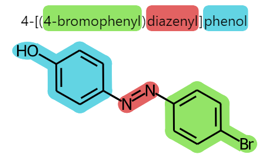
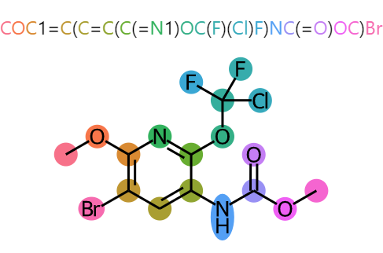

# MolHighlighter

[](https://www.rdkit.org/)

Simple interface for generating multicolor substructure highlights. Can be paired with highlighting of text in a label.

<p float="left">
    
    
</p>

## 🐍 Installation

Make sure RDKit (version `>=2022.03.1`) is installed, then:

```python
pip install git+https://github.com/cbouy/molhighlighter.git
```

## 📜 Usage

### Simple substructure highlight

```python
from rdkit import Chem
import molhighlighter as mh

mol = Chem.MolFromSmiles("C1=CC(=CC=C1N=NC2=CC=C(C=C2)Br)O")

highlights = [
    mh.Smarts(mol, "c1ccccc1Br", fill_ring=True),
    mh.Smarts(mol, "N=N"),
    mh.Smarts(mol, "c1ccccc1O", fill_ring=True),
]
mh.MolHighlighter(mol, highlights)
```

### Substructure highlight paired with label highlighting

```python
from rdkit import Chem
import molhighlighter as mh

mol = Chem.MolFromSmiles("C1=CC(=CC=C1N=NC2=CC=C(C=C2)Br)O")
name = "4-[(4-bromophenyl)diazenyl]phenol"

highlights = [
    mh.Smarts(mol, "c1ccccc1Br", "bromophenyl", fill_ring=True),
    mh.Smarts(mol, "N=N", "diazenyl"),
    mh.Smarts(mol, "c1ccccc1O", "phenol", fill_ring=True),
]
mh.MolHighlighter(mol, highlights, label=name)
```

See the [demo notebook](demo.ipynb) for more info

## ⚖ License

Unless otherwise noted, all files in this directory and all subdirectories are distributed under the Apache License, Version 2.0:
```text
    Copyright 2022 Cédric BOUYSSET

    Licensed under the Apache License, Version 2.0 (the "License");
    you may not use this file except in compliance with the License.
    You may obtain a copy of the License at

        http://www.apache.org/licenses/LICENSE-2.0

    Unless required by applicable law or agreed to in writing, software
    distributed under the License is distributed on an "AS IS" BASIS,
    WITHOUT WARRANTIES OR CONDITIONS OF ANY KIND, either express or implied.
    See the License for the specific language governing permissions and
    limitations under the License.
```
